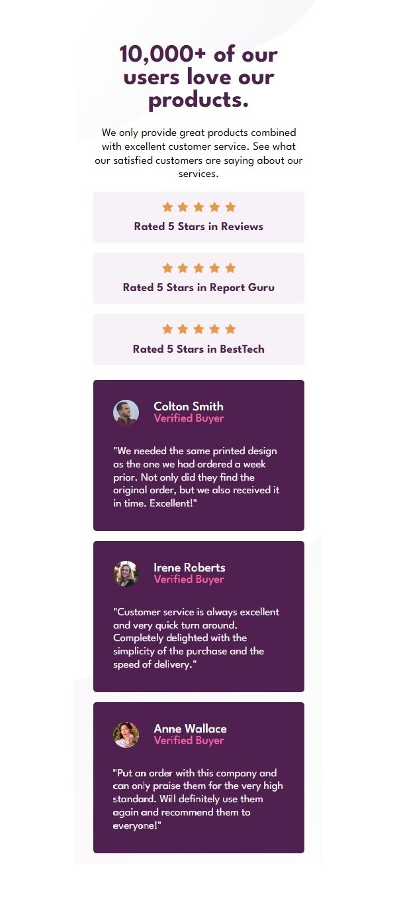
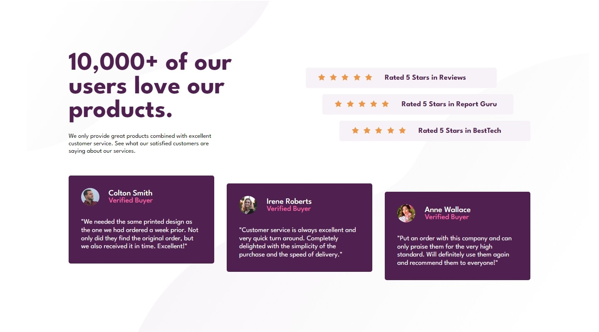

# Frontend Mentor - Social proof section solution

This is a solution to the [Social proof section challenge on Frontend Mentor](https://www.frontendmentor.io/challenges/social-proof-section-6e0qTv_bA). Frontend Mentor challenges help you improve your coding skills by building realistic projects.

## Table of contents

- [Overview](#overview)
  - [The challenge](#the-challenge)
  - [Screenshot](#screenshot)
  - [Links](#links)
- [My process](#my-process)
  - [Built with](#built-with)
  - [What I learned](#what-i-learned)
  - [Continued development](#continued-development)
  - [Useful resources](#useful-resources)
- [Author](#author)
- [Acknowledgments](#acknowledgments)

## Overview

### The challenge

Users should be able to:

- View the optimal layout for the section depending on their device's screen size

### Screenshot




### Links

- Solution URL: [Solution on GitHub](https://github.com/horoserp/social-proof)
- Live Site URL: [Live Site](https://horoserp.github.io/social-proof)

## My process

### Built with

- Semantic HTML5 markup
- CSS custom properties
- CSS Grid
- Flexbox

### What I learned

I continue to expand on my experience with mobile responsiveness. I chose to do this challenge using CSS Grid in combination with Flexbox, which reinforced my knowledge of CSS Grids.

```css
.grid {
  display: grid;
  grid-template-columns: repeat(12, 1fr);
  grid-template-rows: repeat(2, 1fr);
  width: 77.08vw;
  height: 68.75vh;
  gap: 45px 30px;
}
```

### Continued development

I want to explore ways to change the color of .svg files.

### Useful resources

- [W3Schools](https://www.w3schools.com/) - This is a great reference site which helped me remember some of the required syntax.
- [Stack Overflow](https://stackoverflow.com/) - This is an excellent resource for finding answers to precise questions.

## Author

- Website - [Robert P. Horosewski](https://horoserp.github.io/React-Portfolio)
- Frontend Mentor - [@horoserp](https://www.frontendmentor.io/profile/horoserp)
- LinkedIn - [Robert P. Horosewski](https://www.linkedin.com/in/robert-horosewski-8a0608196/)

## Acknowledgments

Thanks to my wife for the encouragement to pursue my dream.
